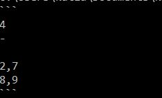
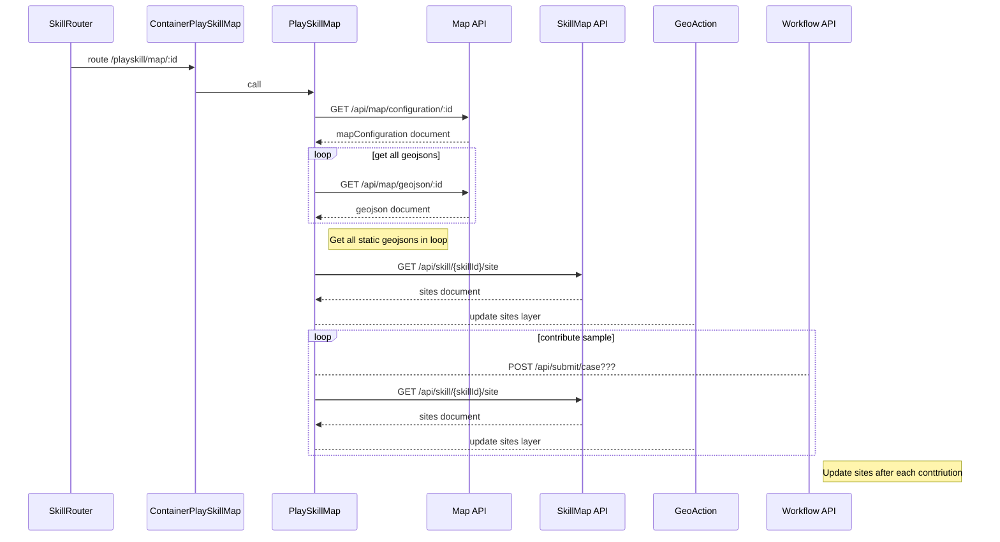

# KnapsackProblem
Knapsack problem solved with BB variation

# Usage 

To run with jar you need to use the following command
<pre>
...> java -jar -Dfile.encoding=UTF-8 KnapsackProblem.jar "d:/path/sampleInput.txt"
</pre>

The expected output for testing file is 

Syntax errors are displayed in red on console (error stream).
When application is starting from .class it does not need any encoding parameter. 

# Problem Analysis 

The packing problem defined in Problem Description can be considered as a variant of Knapsack Problem which is very commonly known 
Discrete Optimization Problem. The variant considered here is known as Bounded 0-1 Knapsack Problem (because item can be presented maximum once in a solution).
The decision problem form of the knapsack problem is NP-complete, so the naive approach with exhaustive search is undesirable 
for large number of variables. The solution can be by:
- application of greedy search algorithms (Sequential Forward, Backward, Plus-Minus, Bidirectional, Beam Search, etc.),
- application of exhaustive search strategy.

## Problem formulation
Given a set of n items numbered from 1 up to n, each with a weight w_i and a cost value v_i, along with a maximum weight capacity W:

maximize: 

subject to: 

where: x_i is binary {0,1} variable, and i is in {1,2,3,...,c} and sum of x_i <15.

The additional constraints, ie.  maximum cost of item<100  and maximum weight of item <100 do not affect on the solution of optimization problem, because items can be removed from list of candidates for solution.

## Solution with Branch and Bound
Since we can assume monotonicity assumption (addition of items can only increase both total cost and total weight, because they are just summing up and nonnegative), then Branch and Bound Strategy can be applied effectively. 
B&B discovers branches within the complete search space by using estimated bounds to limit the number of possible solutions. The different types (FIFO, LIFO, LC) define different 'strategies' to explore the search space and generate branches.

* FIFO (first in, first out): always the oldest node in the queue is used to extend the branch. This leads to a breadth-first search, where all nodes at depth d are visted first, before any nodes at depth d+1 are visited.

* LIFO (last in, first out): always the youngest node in the queue is used to extend the branch. This leads to a depth-first search, where the branch is extended through every 1st child discovered at a certain depth, until a leaf node is reached.

* LC (lowest cost): the branch is extended by the node which adds the lowest additional costs, according to a given cost function. The strategy of traversing the search space is therefore defined by the cost function.

I decided  to use  the least cost(LC) variant as it uses Heuristic Cost Function. 
As 0/1 Knapsack is about maximizing the total value, and BB algorithm is about minimalization, then the problem needs to be converted by taking negative of the given values. 

The implemented algorithm works as follows:

 1. Filter out items which are too heavy or too costly (>100)

 2. Sort items based on cost/weight ratio

 3. Insert empty node to PriorityQueue

 4. Iteratively perform B&B with LC 

# Implementation of Skill map

## Skills with map API
Please see this :

# Skills with map (API)

 
<code>GET</code> <code><b>/api/map/configuration/{id}</b></code>

Get configuration for geo component. 

        {
            "uuid":"cc8ee452-7fa4-4ccd-bb67-14f6923f1af6",
            "configuration": {           
                "width": "600px",
                "height": "400px",
                "center": [51, 11],
                "zoom": 4,
                "basemap": "gray-vector",
                "viewType": "scene",
                "uiComponents":["attribution"],
                "layers": {
                                  "url": "/dist/jsonDocs/geojson/Europe.geojson",
                                  "renderer": {
                                      "type": "simple",
                                      "symbol": {
                                          "type": "simple-fill",
                                          "color": [
                                              251,
                                              154,
                                              153,
                                              1
                                          ],
                                          "style": "solid",
                                          "outline": {
                                              "width": 1.5,
                                              "color": [
                                                  251,
                                                  154,
                                                  153,
                                                  1
                                              ]
                                          }
                                      }
                                  },
                                  "title": "Europe"
                              },               
            }
        }
    
##### Parameters

> | name      |  type     | data type               | description                                                           |
> |-----------|-----------|-------------------------|-----------------------------------------------------------------------|
> | id      |  required | string  | The map configuration UUID  |

##### Responses

> | http code     | content-type                      | response                                                            |
> |---------------|-----------------------------------|---------------------------------------------------------------------|
> | `200`         | `application/json`        | `{"id":"", map: {"siteId": "uuid", "numberOfCases": 2}`                                |
> | `400`         | `application/json`                | `{"code":"400","message":"Bad Request"}`                            |

## Get the geojson

 
<code>GET</code> <code><b>/api/map/geojson/{id}</b></code>

Get static geojson file from backend.

##### Parameters

> | name      |  type     | data type               | description                                                           |
> |-----------|-----------|-------------------------|-----------------------------------------------------------------------|
> | id      |  required | string  | The geojson UUID  |

##### Responses

> | http code     | content-type                      | response                                                            |
> |---------------|-----------------------------------|---------------------------------------------------------------------|
> | `200`         | `application/json`        | `{"id":"123aaf-22-6454", "data":"{geojson}"}` |
> | `400`         | `application/json`                | `{"code":"400","message":"Bad Request"}`                            |                                                      

## Get list of centers (Skill API)

 
<code>GET</code> <code><b>/skill/{skillId}/site</b></code> 

Only compatible with skills having the type "map".

##### Parameters

> | name      |  type     | data type               | description                                                           |
> |-----------|-----------|-------------------------|-----------------------------------------------------------------------|
> | skillId      |  required | string  | The skill UUID  |

##### Responses

> | http code     | content-type                      | response                                                            |
> |---------------|-----------------------------------|---------------------------------------------------------------------|
> | `200`         | `application/json`        | `{"map": [ {"siteId": "uuid", "cases": [{"key": "case1", "available": true}]}]}`                                |
> | `400`         | `application/json`                | `{"code":"400","message":"Bad Request"}`                            |

